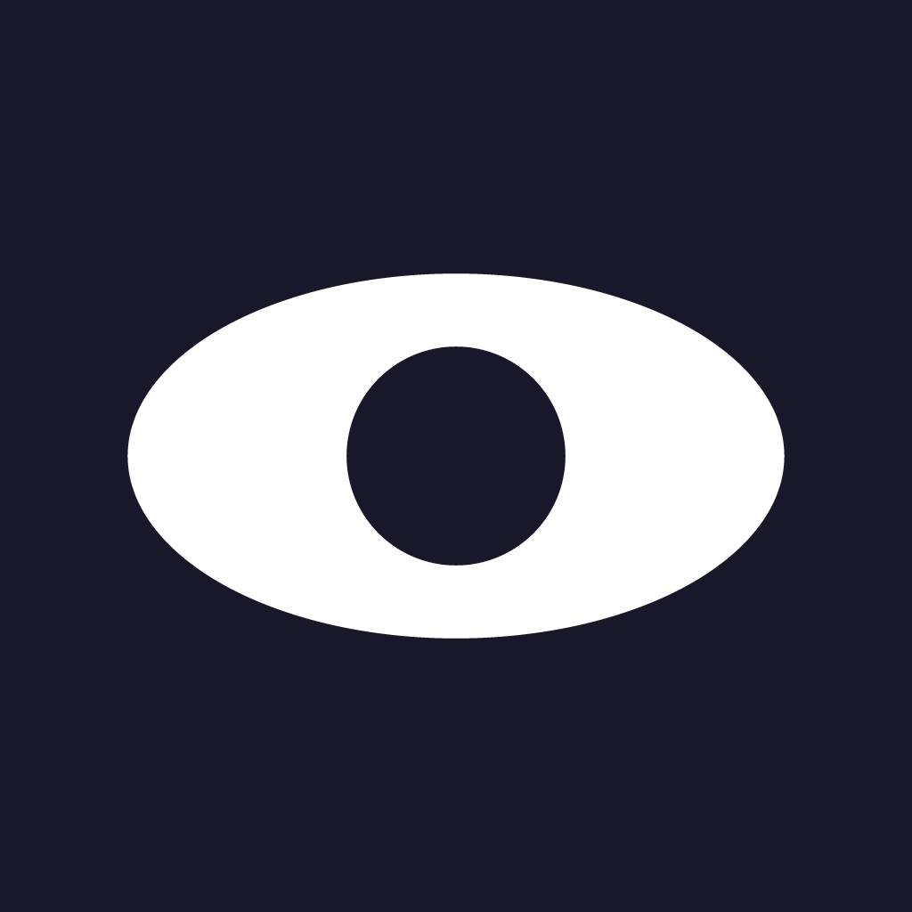

<p align="center">
  
</p>

<h1 align="center">VigilCLI</h1>

<p align="center">
  A floating desktop monitor for AI CLI sessions — Claude Code, Codex, Cursor, and more.
</p>

<p align="center">
  
  
  
</p>

---

## What it does

VigilCLI sits in your menu bar and shows you everything happening across all your AI coding sessions in real time. When an agent needs permission to run a dangerous command, a chat bubble pops up so you can approve or deny — without switching windows.


---

## Features

### Session Monitor
- **Real-time session list** — floating card panel showing every active AI session with its status (running / waiting / error / notification), working directory, elapsed time, and sub-agent count
- **Click to focus** — click any card to jump straight to the matching terminal window (VS Code / Cursor terminal supported on macOS)
- **Dynamic height** — panel shrinks to a compact bar when idle, expands smoothly as sessions accumulate (up to 5 cards, then scrollable)

### Permission Bubbles
- **Inline approval UI** — when Claude Code needs to run Bash, write a file, or call an agent, a directional chat bubble appears next to the session card
- **One-click decisions** — Allow / Deny with optional "always allow" and suggested shortcuts (auto-accept edits, Plan mode)
- **Bubble follows the window** — the bubble tracks the session card position across displays and moves with the window

### Codex CLI Support
- **Zero-config log monitoring** — automatically detects and reads Codex JSONL logs without needing any hook installation
- **Session name display** — shows the `/rename`-set session name from Codex

### Customization
| Option | Choices |
|--------|---------|
| Theme | `dark` · `light` · `purple` · `ocean` |
| Font size | `small` · `medium` · `large` |
| Language | `en` · `zh` |
| Sound | enabled / muted |
| Do Not Disturb | suppresses all bubbles |
| Tray icon | show / hide |

---

## Installation

### Download (recommended)

Grab the latest release for your platform from the [Releases](../../releases) page:

| Platform | File |
|----------|------|
| macOS (Apple Silicon) | `VigilCLI-*-arm64.dmg` |
| macOS (Intel) | `VigilCLI-*-x64.dmg` |
| Windows | `VigilCLI-Setup-*.exe` |
| Linux | `VigilCLI-*.AppImage` or `.deb` |

### macOS: open without quarantine warning

```bash
xattr -cr /Applications/VigilCLI.app
```

---

## Hook setup (Claude Code)

VigilCLI intercepts Claude Code tool calls via a hooks config. Run the post-install hook once:

```bash
# In your Claude Code project or globally
# VigilCLI installs hooks automatically on first launch
```

Or manually add to your `.claude/settings.json`:

```json
{
  "hooks": {
    "PreToolUse": [
      {
        "matcher": ".*",
        "hooks": [
          {
            "type": "command",
            "command": "node /path/to/vigilcli/hooks/dist/claude-hook.js"
          }
        ]
      }
    ]
  }
}
```

---

## Build from source

```bash
# Install dependencies
npm install

# Run in dev mode
npm start

# Build for macOS (produces DMG for arm64 + x64)
npm run build:mac

# Build for Windows
npm run build

# Build for Linux
npm run build:linux

# Build TypeScript + hooks
npm run build:all-ts
```

Requires **Node.js 18+** and **Electron 41**.

---

## Supported tools

| Tool | Hook method | Session detect |
|------|------------|----------------|
| Claude Code | PreToolUse hook | ✅ |
| Codex CLI | JSONL log monitor | ✅ |
| Cursor | (planned) | — |
| Gemini CLI | hook installer included | ✅ |

---

## License

MIT © [somethingforheheda](https://github.com/somethingforheheda)
