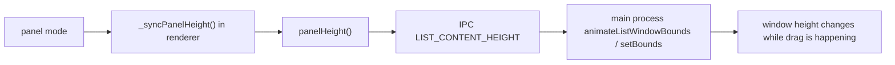
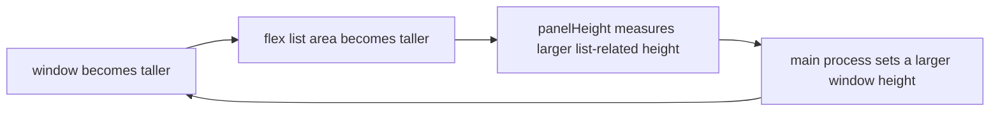

# Windows Panel Drag Debug Log

Date: 2026-04-18

## Summary

Problem statement:
When the floating panel is dragged continuously on Windows, the panel height keeps growing.

Current repo state for this branch:
All code changes from my two attempted fixes have been reverted.
This branch is intended to carry notes only, so Windows-side debugging can start from the original behavior.

## Symptom

- Repro described by user: on Windows, if the panel is kept in a dragging state, it becomes taller and taller.
- The earlier fixes I tried did not solve the issue.
- Because I could not reproduce on a real Windows machine here, every conclusion below should be treated as a hypothesis from static analysis plus packaging attempts.

## Relevant Files

| File | Why it matters |
| --- | --- |
| `src/list-renderer.js` | Renderer-side panel height calculation and drag event forwarding |
| `src/list.html` | Panel layout, especially `#cap-body` and `#slist` sizing behavior |
| `src/main.ts` | Main-process handling of `LIST_CONTENT_HEIGHT`, `move-window`, and `snap-to-edge` |
| `src/main.js` | Runtime file used by default when not starting with `VIGILCLI_DEV_TS=1` |
| `src/main-entry.js` | Confirms packaged/default runtime loads `src/main.js` |

## Code Path I Investigated



Main locations:

- `src/list-renderer.js`
  - `panelHeight()`
  - `_syncPanelHeight()`
  - drag handlers on `#orb`, `#cap-bar`, `mousemove`, `mouseup`
- `src/main.ts`
  - `ipcMain.on(IpcChannels.LIST_CONTENT_HEIGHT, ...)`
  - `ipcMain.on("move-window", ...)`
  - `ipcMain.on("snap-to-edge", ...)`

## Attempt 1

Idea:
Block height synchronization while the window is being dragged, and keep using main-process coordinates for snap logic.

Files changed during the attempt:

- `src/main.ts`
- `src/main.js`

What I changed:

- Added a `listWinDragging` flag
- Ignored `LIST_CONTENT_HEIGHT` events while dragging
- Canceled snap animation when drag started
- Used main-process `getBounds()` in `snap-to-edge`
- Added an `onDone` callback to `animateWindowPos`

Why I tried it:

- The first hypothesis was that height updates and drag movement were racing with each other, especially on Windows DPI / transparent frameless windows.

Result:

- User reported no meaningful improvement.
- Conclusion: blocking height sync during drag may avoid one feedback path, but it was not the real root cause.

Status:
Reverted.

## Attempt 2

Idea:
The real issue might be renderer-side self-reinforcing height measurement.

Files changed during the attempt:

- `src/list-renderer.js`
- `src/list.html`

What I changed:

- In `panelHeight()`, changed `#slist.scrollHeight` to `#slist.offsetHeight`
- Changed `#slist` from `flex: 1` to `flex: 0 1 auto`

Why I tried it:

- `#slist` was both a flex item that could fill remaining height and a source of the reported panel height.
- That looked like a possible positive feedback loop:



Result:

- User reported it still had no effect.
- Conclusion: this layout theory was also insufficient, or the real trigger is elsewhere.

Status:
Reverted.

## Important Observation

There was a mismatch between `src/main.ts` and `src/main.js` during investigation:

- Default runtime path loads `src/main.js`
- Development path with `VIGILCLI_DEV_TS=1` loads `src/main.ts`

That mismatch mattered while testing attempted fixes, but all attempted code changes have now been removed from both files.

## What I Would Debug On Windows Next

Most useful next step:
capture actual runtime numbers during drag on Windows instead of guessing from static code.

Suggested probes:

1. In renderer `panelHeight()` log:
   - `bar.offsetHeight`
   - `list.scrollHeight`
   - `list.offsetHeight`
   - `list.clientHeight`
   - `window.innerHeight`
   - `document.body.getBoundingClientRect().height`

2. In main `LIST_CONTENT_HEIGHT` handler log:
   - incoming `contentHeight`
   - current `listWin.getBounds()`
   - every `newH` applied

3. During drag log:
   - renderer `screenX/screenY`
   - main `getBounds().x/y/height`
   - whether `LIST_CONTENT_HEIGHT` continues firing while mouse is held

4. Check whether `renderRows()` or `reportCardPositions()` indirectly changes layout during drag.

5. Check whether Windows display scaling is involved:
   - test at 100%
   - test at 125%
   - test at 150%

## Candidate Root Causes Still Open

- `panelHeight()` may still be fed by a metric that grows as a consequence of window resize on Windows only.
- `LIST_CONTENT_HEIGHT` may be firing repeatedly during drag because some periodic renderer update keeps relayouting the panel.
- Windows may be reporting logical and physical coordinates differently enough that repeated snap / move behavior perturbs height indirectly.
- There may be a transparent frameless window quirk specific to Electron 41 on Windows.

## Build / Packaging Notes

I successfully built a Windows package during the investigation from macOS using:

```bash
npx electron-builder --win --x64
```

That proved packaging worked in this environment, but it did not prove the UI fix, because I could not interact with the built app on a real Windows desktop here.

## Branch Intent

This branch should contain:

- no code fix for the bug
- only this investigation record

That way you can switch to it on the Windows machine and debug from the original behavior without my failed attempts mixed in.
